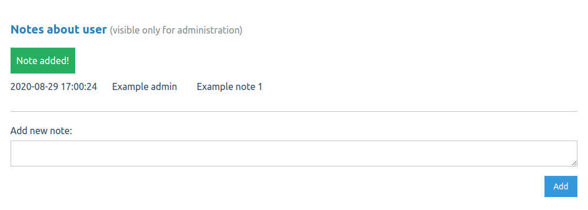

# Notes about users - plugin to [Question2Answer](http://question2answer.org/)

This plugin adds place for notes on user profile. You can simple save information about user, for example warnings, blockade reason or anything. Notes are available only for administration users (experts, editors, moderators, admins, super admins).

Administration user can add and view notes. Note contain content text, creation date and author. At this moment, plugin don't provide note updating or deleting - its intentional protection before changing history. In addition, if any note already exists for user, you see small box with count on the top right profile page side (only on desktop screens).

Tested on **Q2A version >= 1.7.0 and PHP >= 7.0**. Code style adjusted to Q2A style.

## Installation

Clone or download this repository or selected [release](https://github.com/awaluk/q2a-users-notes/releases) to *qa-plugin* directory in your Q2A.
 
## Configuration

Go to admin panel and `Plugins` tab (*/admin/plugins*). Q2A should automatically prompt for execute database changes, for example by red alert on page top: `The Users notes widget module requires some database initialization`. Click it.

Then, navigate to `Layout` tab and find *Users notes* widget. Click *add widget* and set position. You can test few if you need, recommended is *Full width - Below content*. Now plugin is ready. Go to any user profile, scroll to bottom and test it.

## Screenshots

